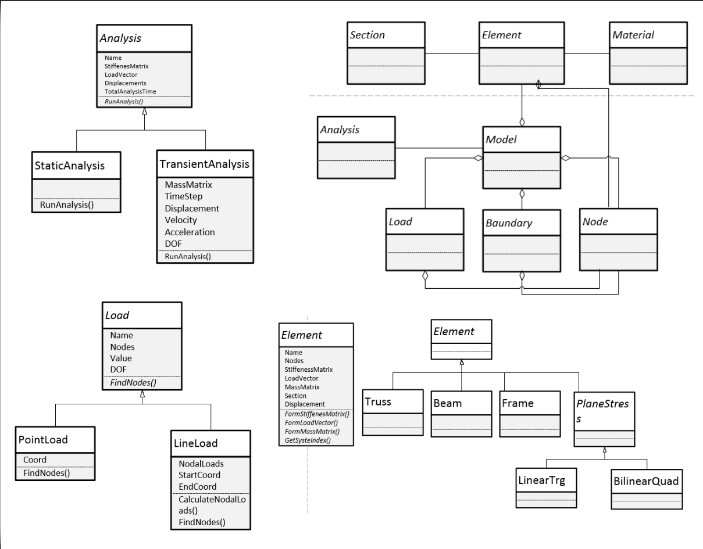

# OOFEM
OOFEM is an object-oriented finite element framework for 2D linearly elastic structural analysis. The implemented framework is capable of handling both static and transient analysis scenarios. The paper describing this framework can be found at [Melaku et al.(2015)](https://www.researchgate.net/publication/353599408_Application_of_Object-Oriented_Finite_Element_Method_in_Structural_Mechanics)

